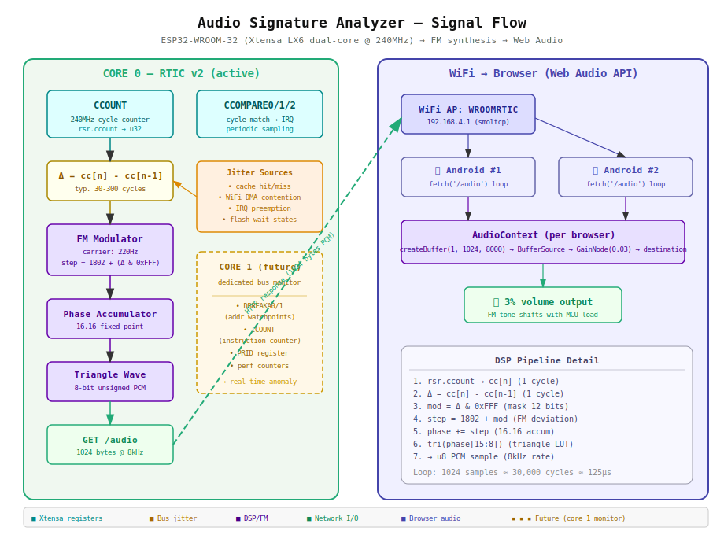

# Audio Signature Analyzer — WROOMRTIC

## Signal Flow



---

## What it does

The ESP32 reads its own **CCOUNT** register (a 240MHz hardware cycle counter)
in a tight loop and uses the timing jitter between successive reads as the
**modulation signal** for an FM synthesizer. The result is streamed as raw
8-bit PCM over HTTP to any connected browser, where Web Audio plays it at
3% volume.

The tone shifts audibly when the MCU is under load — WiFi DMA, cache misses,
interrupt preemption, and flash wait states all change the inter-read timing.

**Confirmed**: two Android phones streaming audio simultaneously from the
same ESP32. The sequential HTTP model handles this because each `/audio`
request is a short 1024-byte burst (~125μs to generate).

---

## CCOUNT — the Xtensa cycle counter

```
rsr.ccount a2      ; read CCOUNT into register a2 (1 cycle)
```

| Property | Value |
|----------|-------|
| Register | CCOUNT (Special Register 234) |
| Width | 32 bits |
| Frequency | CPU clock = 240 MHz |
| Rollover | every ~17.9 seconds |
| Read cost | 1 cycle (RSR instruction) |
| Writable | yes (WSR.CCOUNT), but not recommended |

CCOUNT is a free-running counter that increments every CPU clock cycle.
Unlike ARM's DWT CYCCNT, it is always enabled — no configuration needed.

### Why the delta varies

A `rsr.ccount` pair in a tight loop should see a constant delta (the loop
body's cycle count). But the observed delta jitters because:

| Source | Effect on Δ | Typical range |
|--------|------------|---------------|
| **Instruction cache miss** | +10–40 cycles (flash fetch) | common during cold code |
| **Data cache miss** | +4–20 cycles (SRAM/PSRAM) | depends on access pattern |
| **WiFi DMA** | +20–200 cycles (bus arbitration) | periodic, ~3ms intervals |
| **Interrupt preemption** | +50–2000 cycles | depends on ISR duration |
| **Flash wait states** | +2–8 cycles | when executing from flash |
| **PSRAM contention** | +8–40 cycles | if SPIRAM configured |

These micro-timing variations are the "fingerprint" of MCU activity.

---

## The FM synthesizer

### DSP pipeline (runs on core 0, inside `generate_audio_buffer`)

```
   CCOUNT[n]  ──►  Δ = CCOUNT[n] - CCOUNT[n-1]
                          │
                          ▼
                   mod = Δ & 0xFFF        (12-bit mask)
                          │
                          ▼
                   step = 1802 + mod      (FM: base 220Hz + deviation)
                          │
                          ▼
                   phase += step          (16.16 fixed-point accumulator)
                          │
                          ▼
                   tri(phase[15:8])       (triangle wave lookup)
                          │
                          ▼
                   u8 PCM sample          (0–255, unsigned)
```

**Parameters**:
- Carrier frequency: 220 Hz (A3)
- Sample rate: 8000 Hz
- Phase step at rest: 1802 (= 220/8000 × 65536)
- Modulation index: up to 4095 (12-bit mask on delta)
- Waveform: triangle (no lookup table, computed from phase)
- Buffer: 1024 samples = 128ms of audio per HTTP request

### Why FM, not raw aliasing

Raw CCOUNT low-byte aliasing produces broadband noise — interesting but
hard to interpret. FM modulation converts timing jitter into **pitch
variation** around a known carrier, which is:
1. Easier to hear (tonal vs noise)
2. Easier to analyze (spectrogram shows deviation bands)
3. More sensitive to small changes (a 10-cycle shift moves pitch noticeably)

---

## What else CCOUNT can do (DSP-wise)

### 1. Spectral analysis of MCU health

Sample CCOUNT deltas into a ring buffer, then compute a running FFT
(or simpler: zero-crossing rate, RMS, peak-to-peak). Anomalous patterns
indicate:
- Memory corruption (unexpected cache invalidation bursts)
- DMA overrun (WiFi driver stuck in long transfers)
- Interrupt storm (delta distribution shifts to bimodal)

### 2. Timing-accurate profiling

```rust
let t0: u32;
unsafe { core::arch::asm!("rsr.ccount {0}", out(reg) t0) };
// ... code under test ...
let t1: u32;
unsafe { core::arch::asm!("rsr.ccount {0}", out(reg) t1) };
let cycles = t1.wrapping_sub(t0);
// At 240MHz: cycles / 240 = microseconds
```

Zero overhead. No timer peripheral needed. Works in interrupts.

### 3. CCOMPARE — cycle-accurate interrupts

The ESP32 has three compare registers: CCOMPARE0, CCOMPARE1, CCOMPARE2.
When CCOUNT matches a CCOMPARE value, an interrupt fires at the configured
level.

```rust
// Fire interrupt after exactly 24000 cycles (100μs at 240MHz)
let target: u32;
unsafe {
    core::arch::asm!("rsr.ccount {0}", out(reg) target);
    let next = target.wrapping_add(24_000);
    core::arch::asm!("wsr.ccompare0 {0}", in(reg) next);
}
```

This enables **precise periodic sampling** — a dedicated CCOMPARE ISR could
sample bus state at exactly 10kHz, 44.1kHz, or any rate, independent of the
main loop timing.

---

## Deep embedded: address bus monitoring on ESP32

### What the Xtensa LX6 offers

| Mechanism | Register | What it does |
|-----------|----------|-------------|
| **Data breakpoints** | DBREAKA0, DBREAKA1 | Trigger exception on memory access to a specific address |
| **Data break control** | DBREAKC0, DBREAKC1 | Mask + read/write select (match address range) |
| **Instruction breakpoints** | IBREAKA0, IBREAKA1 | Trigger on instruction fetch at address |
| **Instruction counter** | ICOUNT | Counts instructions, fires at ICOUNTLEVEL |
| **Debug cause** | DEBUGCAUSE | Which debug event fired (BN, BI, DB, etc.) |
| **PRID** | PRID | Core identification (0 or 1) |

### The smartest approach: dual-core split

The ESP32 has **two LX6 cores** (PRO_CPU and APP_CPU). RTIC currently uses
only core 0. The second core could be a dedicated **bus monitor**:

```
┌──────────────────────┐    ┌──────────────────────┐
│     CORE 0 (PRO)     │    │     CORE 1 (APP)     │
│                      │    │                      │
│  RTIC application    │    │  Bus Monitor Task    │
│  • WiFi              │    │  • DBREAKA0/1 armed  │
│  • HTTP server       │    │  • CCOMPARE periodic │
│  • audio gen         │    │  • pattern analysis  │
│  • idle loop         │    │  • anomaly detection │
│                      │    │                      │
│  (normal firmware)   │    │  (supervisor mode)   │
└──────────────────────┘    └──────────────────────┘
         │                           │
         └────── shared SRAM ────────┘
              (lock-free ring buffer)
```

**Why this works on Xtensa but is harder on ARM:**

1. **DBREAKA/DBREAKC are software-accessible** — on ARM Cortex-M, the
   DWT comparators exist but data watchpoints trigger a DebugMonitor
   exception that requires halting debug or a debug monitor handler.
   On Xtensa, data break exceptions are a normal exception class that
   firmware can handle directly.

2. **Two independent cores with separate CCOUNT** — each core has its own
   cycle counter. Core 1 can do continuous monitoring without affecting
   core 0's timing.

3. **No TrustZone/privilege complications** — Xtensa's ring-based protection
   is simpler. Running the monitor at ring 0 gives full register access
   without complex SAU/IDAU/MPU configuration.

### What a hardware data breakpoint sees

```rust
// Arm DBREAKA0 to watch writes to address 0x3FFB_0100..0x3FFB_01FF
unsafe {
    // DBREAKA0 = base address
    core::arch::asm!("wsr.dbreaka0 {0}", in(reg) 0x3FFB_0100u32);
    // DBREAKC0: bit 31 = enable, bit 30 = write, bits [5:0] = size mask
    //   size mask 0x3F = match any address where low 8 bits match (256-byte window)
    core::arch::asm!("wsr.dbreakc0 {0}", in(reg) 0xC000_00FFu32);
}
```

When core 1 hits a data break, the exception handler records:
- EPC (the PC that caused the access)
- EXCVADDR (the exact address accessed)
- CCOUNT (precise timing)

This creates a **memory access trace** for a watched region — without
touching core 0 at all.

### A practical address bus sonification

Instead of sampling CCOUNT jitter (what we do now), a more targeted
approach:

1. **Watch a peripheral register** (e.g., WiFi DMA descriptor at 0x3FF46000)
2. **Count accesses per ms** using CCOMPARE-driven sampling on core 1
3. **FM-modulate the access rate** → hear DMA bursts as pitch spikes
4. **Watch stack pointer region** → hear function call depth as pitch

### The FPGA vision

The user's idea of an FPGA on the address bus is the ultimate version:

```
ESP32 address bus ──► FPGA (parallel sniffer)
                         │
                         ├── pattern matching (hardware FSM)
                         ├── anomaly detection (trained model)
                         ├── real-time histogram of access patterns
                         └── alert line back to ESP32 GPIO
```

The FPGA would see **every** bus transaction without any CPU overhead.
This is what Lauterbach TRACE32 and ARM ETM do, but with custom logic
instead of a $10k debug probe.

For the ESP32 specifically, the external bus (PSRAM, flash) is accessible
on physical pins. Internal SRAM transactions are not externally visible —
those can only be monitored with the software DBREAKA approach above.

---

## Current implementation status

| Feature | Status |
|---------|--------|
| CCOUNT delta → FM audio | ✅ working |
| 8kHz 8-bit PCM over HTTP | ✅ working |
| Web Audio playback at 3% | ✅ working |
| Multi-client streaming | ✅ confirmed (2 phones) |
| `audio on/off` shell command | ✅ working |
| SND button in status bar | ✅ working |
| Core 1 bus monitor | 🔮 future |
| DBREAKA address watchpoints | 🔮 future |
| CCOMPARE periodic sampling | 🔮 future |
| FPGA external bus sniffer | 🔮 concept |

---

## References

- Xtensa ISA Reference Manual — Chapter 4.7 (Timers), Chapter 6 (Debug)
- ESP32 Technical Reference Manual — Chapter 1.3 (Address Mapping)
- Cadence Tensilica Xtensa LX6 core documentation
- Pybricks `lib/pbio/src/` — port_lump.c for comparison protocol patterns
